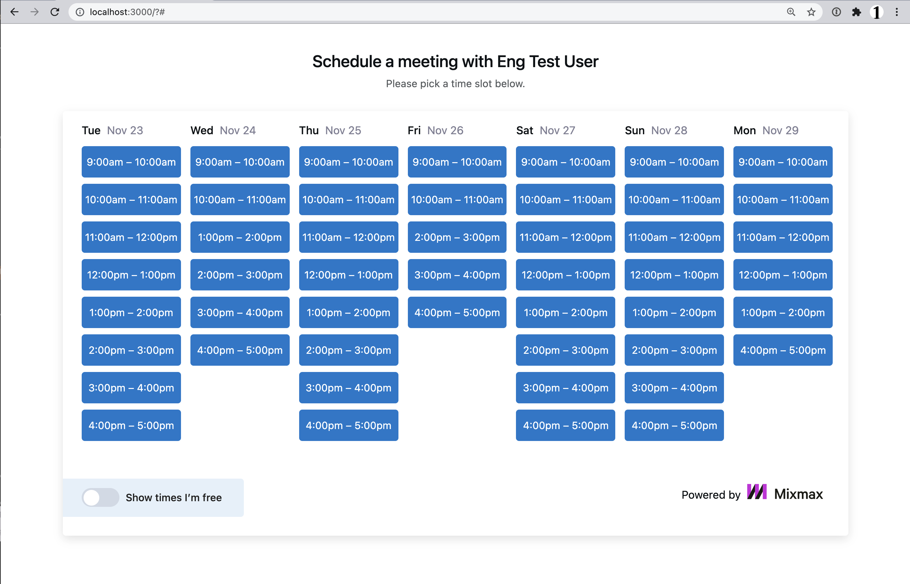

# Introduction

In this coding exercise you're coding a simplified version of the server-side logic
for [Mixmax's Calendar feature](https://www.mixmax.com/calendar). See an example calendar [here](https://cal.mixmax.com/demo/30). The purpose of this feature is to allow a guest to book a meeting on a Mixmax user's calendar (the "host"). The calendar shows time slots that the host is available; that is, times for which they don't have an overlapping event on their own calendar. We wouldn't want to double-book them!

You'll complete the two parts below. The whole exercise should take you around 1 hour. Your deadline is 3 days after you first receive this. Please return your solution by zip/tgz file in the same email thread.

# Setup

After unpacking the zip/tgz file, run the following:

```
cd package
npm install
npm test
npm start
```

Then open <http://localhost:3000/> in your browser.

You'll see a calendar with a list of available times to meet with our fictional host, Eng Test User. This is a simplified version of Mixmax's Calendar that you can find [here](https://cal.mixmax.com/demo/30).

When you're done, you can create a `.tgz` file to send back by running `npm pack`.

# File structure

`./client` - Client browser files. You do not need to edit this.

`./docs` - Files for the README. You do not need to edit this.

`./mock` - Mock database. Use the provided `db` package as described below. You do not need to edit this.

`./server` - You will need to edit these files.

Feel free to create files and directories as you see fit.

# Specifications

If you look at `server/api/calendar.js`, you'll see that endpoint `/api/calendar` returns a hardcoded list of times. You need to write code to return time slots which are available for the given host in the next 7 days starting tomorrow. It should exclude time slots that overlap with events in the user's calendar. Assume that time slots last exactly one hour and start on the hour between 9am and 4pm (so the last one of the workday will be from 4pm to 5pm).

You can obtain the list of events in a user's calendar by querying a database as follows:

```js
const db = require("db");
const events = await db.calendar.findEventsForUser(username);
```

`db.calendar.findEventsForUser` returns an array of objects structured as per this example:

```js
{
  start: '2021-11-21T15:05:00.000',
  end: '2021-11-21T16:25:00.000',
}
```

You can assume that times are in your computer's local timezone, and that the server and browser are on the same timezone.

We provided the library [momentjs](https://momentjs.com/) to help you manipulate dates, but feel free to use another time/date library of your preference.

At the conclusion of the exercise, your calendar should show time slots on which the host is available, similar to this:


